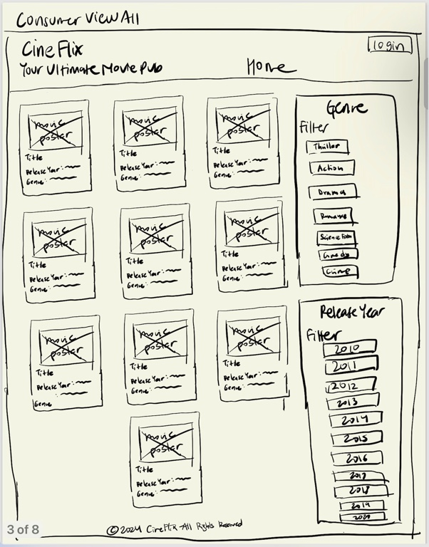
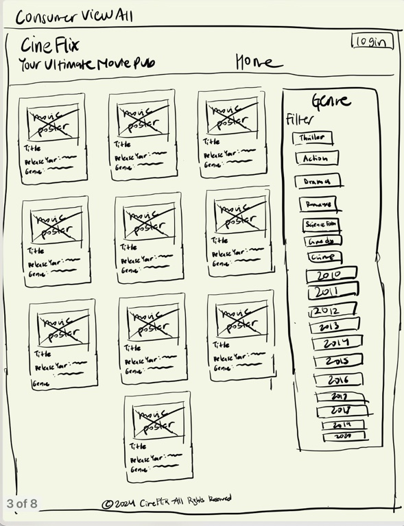
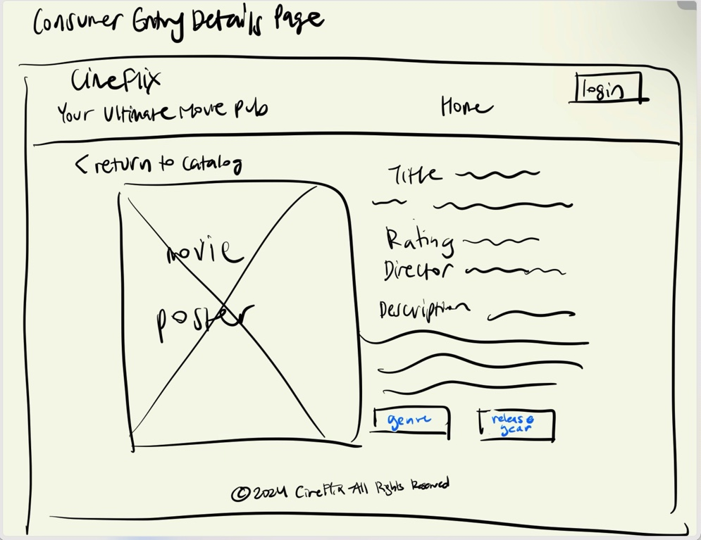
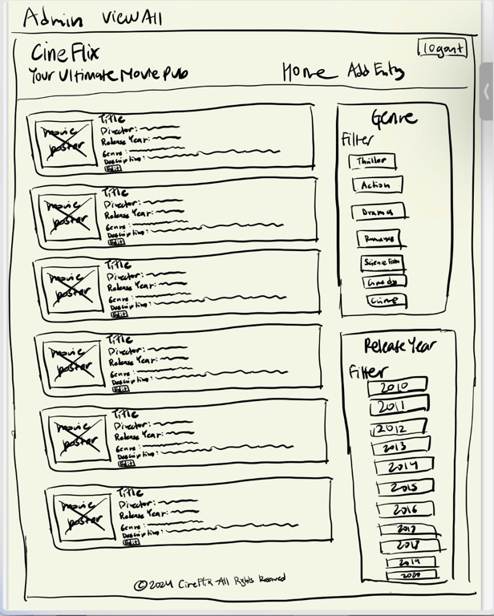
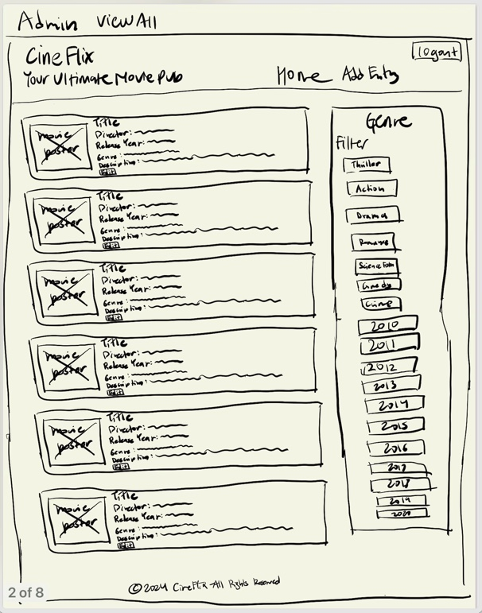
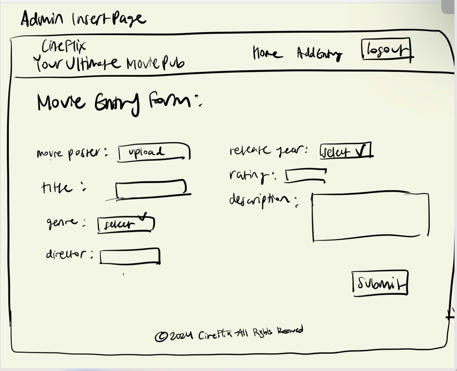
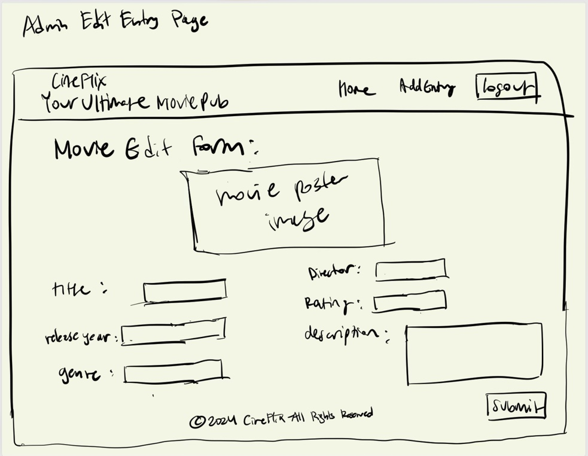
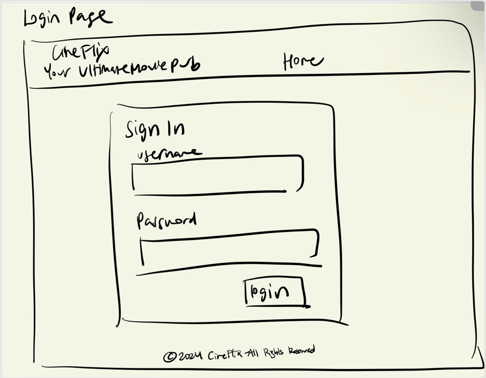

# Project 3, Milestone 1: **Team** Design Journey

[← Table of Contents](design-journey.md)

**Make the case for your decisions using concepts from class, as well as other design principles, theories, examples, and cases from outside of class (includes the design prerequisite for this course).**

You can use bullet points and lists, or full paragraphs, or a combo, whichever is appropriate. The writing should be solid draft quality.

## Catalog
> What will your catalog website be about? (1 sentence)

Our catalog website will be about movies.

## Narrow or Wide Screen
> How will your **consumer** user access this website? From a narrow or wide screen?

Our user will acess our website from a wide screen.

## Catalog Design
> Sketch each page of your entire media catalog website
> Provide a brief explanation _underneath_ each sketch. (1 sentence per sketch)
> **Refer to consumer or administrator persona by name in each explanation.**

This interface is a catalog view that Max, as a consumer, would use to browse the movie database. It displays movies in a grid/card design with filters for genre and release year to help him find movies that interest him. It does not show all the details and just the title, movie poster, release year, and genre which are the concised. important details.

Edited the old view all page to not group the tages in the side bar.

This page is designed for Max, the movie enthusiast consumer, providing a detailed view of a selected movie, including the movie poster, title, rating, director, and description. It also features buttons for genre and release year for further exploration, which is not shown in the consumer view all page.

Martin Turner would use this page to view all the movie entries he has access to manage. It also provides filters by genre and release year, similar to the consumer view but with administrative privileges. They are all stacked as tiles with a thumbnail with the sidebar filters on the side for common industry design practices and ease of reading to Martin.

Edited the old view all page to not group the tages in the side bar.

This sketch represents the form that Martin Turner, the Content Manager, would use to add new movies to the CineFlix database. It includes fields for uploading a movie poster, inputting the title, genre, director, release year, rating, and description with a submit button with textboxes on both the left and right side which represent industry standard design practices for a form.

Martin Turner uses this page to edit existing movie entries in the database. This form mirrors the insert entry form, allowing him to upload a new poster, change the title, genre, director, release year, rating, and movie description.

This login page is crucial for Martin Turner, allowing him to securely access the admin functionalities of the site to manage the movie catalog. There is a username and password text boxes in a sign in box which shows common design practices and is centered to be easily read to Martin. It can also be used by Max, the consumer, as he can switch to the role of administrator for when he wants to edit the movies.

## Catalog Design Patterns
> Explain how your design employs common catalog design patterns. (1-2 sentences)

The design employs a grid layout for both admin and consumer "view all" pages, which is a common catalog design pattern that provides a visually organized and scalable way to display multiple items. The detail pages follow a clear, consistent structure, promoting ease of navigation and reducing cognitive load for the user. Filters for genre and release year are employed to enhance discoverability and allow users to narrow down their interests efficiently.

## URL Design
> Plan your HTTP routing.
> List each route and the PHP file for each route.

| Page                                     | Route             | PHP File                    |
| ---------------------------------------- | -----------       | --------------              |
| home / consumer view all / filter by tag | /                 | pages/consumer-view-all.php |
| consumer entry details                   | /movie-details    | pages/movie-details.php     |
| admin view all / filter by tag           | /admin/movies     | pages/admin-view-all.php    |
| insert entry                             | /add-movies       | pages/insert-entry.php      |
| admin edit entry / tag / untag           | /admin/movies/edit| pages/admin-edit.php        |
| login                                    | /login            | pages/login.php             |

> Explain why these routes (URLs) are usable for your persona. (1 sentence)

These routes are usable for Max because they provide direct, easy access to simple functionalities like viewing the movies individually and in the entire catalog and also usable for Martin because he can perform admin tasks like adding and editing movies while also seeing the whole catalog through the admin log in.

## Database Schema
> Plan the structure of your database. You may use words or a picture.
> A bulleted list is probably the simplest way to do this.
> Include constraints for each field.

**Table:** movie

- id: INTEGER {PK, U, NN, AI},
- movie_poster: TEXT {NN},
- movie_name: TEXT {NN},
- director: TEXT {NN},
- release_year: INTEGER {NN},
- rating: INTEGER {NN},
- genre: TEXT {NN},
- descript: TEXT {NN}

**Table:** tags

- id: INTEGER {PK, U, NN, AI},
- tag: TEXT {NN}

**Table:** movie_tags

- id: INTEGER {PK, U, NN, AI},
- movie_id: INTEGER {NN},
- tag_id: INTEGER {NN},

## Contributors

I affirm that I have contributed to the team requirements for this milestone.

Consumer Lead: Tiffany Quen

Admin Lead: Josephine Kim

[← Table of Contents](design-journey.md)
